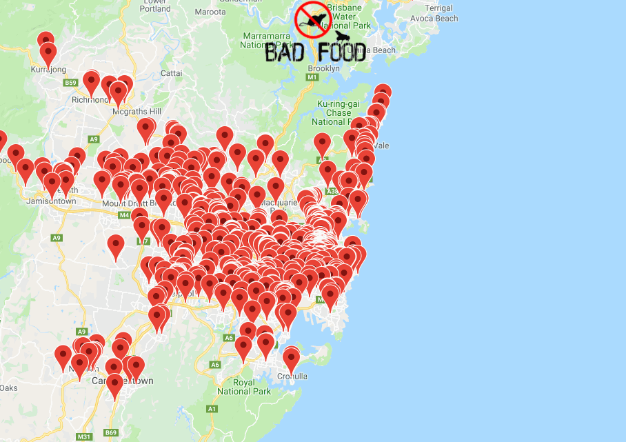

[](http://badfood.io)

<p align="center">
  <a href="https://github.com/TheDen/badfood/issues" alt="contributions welcome">
    </a>
  <a href="https://github.com/TheDen/badfood/blob/master/LICENSE" alt="license">
    </a>
</p>




[BadFood](http://BadFood.io) shows a map of restaurants in Sydney that have been given a penalty from [The Department of Primary Industries Food Authority](http://www.foodauthority.nsw.gov.au/), specifically from the public [penalty notice](http://www.foodauthority.nsw.gov.au/penalty-notices/default.aspx?template=results) and [prosecutions](http://www.foodauthority.nsw.gov.au/offences/prosecutions) lists.

Data is scraped using a spider with python's `scrapy` and stored in a remote `mongo` db—served with NodeJs+Express+EJS on Heroku.

## Building

### Data Crawler
Install the python3 requirements

```bash
pip install -r requirements.txt
```

### Node Server

If you have `nvm` use `nvm install` to install the node version.

Install the dependencies

```bash
npm install
```

## Running

### Data Crawling

To crawl the data from the notice list webpage, and store in in JSON format

```bash
scrapy runspider spiders/spider_notice_list.py -o notice_list.json
```

For the prosecutions list

```bash
scrapy runspider spiders/spider_prosecutions_list.py -o prosecutions_list.json
```

### Importing data to mongo

To import the data to a remote host:

```bash
mongoimport -h <mongohost:port> -d <dbname> -c <collection> -u <username> -p <password> --file <file.json> --jsonArray
```

(leave out the `-p` option to be prompted for the password)

### Running the node webserver

Environment variables needed

* `APIKEY`—The Google maps API URL (including the key), e.g.,

```bash
export APIKEY="https://maps.googleapis.com/maps/api/js?key=<YOUR_KEY>&callback=initMap"
```
* `MONGOURL`—The Mongo database URI, e.g.,

```bash
export MONGOURL="mongodb://<username>:<password>@<host<:<port>/<database>"
```

* `DB_COLLECTION`—The mongo collection, e.g.,

```bash
export DB_COLLECTION="dataset1"
```

Then start the server `node server.js`


## Contributing

* Issues and pull requests are welcome
* Thanks to [Deedee lee](http://github.com/deedeedeeps) for the BadFood emoji logo