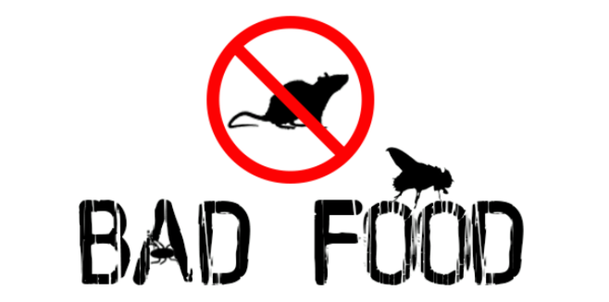

[](https://badfood.theden.sh)

<p align="center">
  <a href="https://github.com/TheDen/badfood/issues" alt="contributions welcome">
    </a>
  <a href="https://github.com/TheDen/badfood/blob/master/LICENSE" alt="license">
    </a>
  <a href="https://github.com/ambv/black" alt="code style python">
    </a>
</p>


[BadFood](http://badfood.theden.sh) shows a map of restaurants in Sydney that have been given a penalty from [The Department of Primary Industries Food Authority](http://www.foodauthority.nsw.gov.au/), specifically from the public [penalty notice](http://www.foodauthority.nsw.gov.au/penalty-notices/default.aspx?template=results) and [prosecutions](http://www.foodauthority.nsw.gov.au/offences/prosecutions) lists.

## Building

### Data Crawler
Install the python3 requirements

```bash
pip install -r requirements.txt
```

## Running

### Data Crawling

To crawl the data from the notice list webpage, and store in in JSON format

```bash
GOOGLE_API_KEY="<YOUR_API_KEY>" scrapy runspider spiders/spider_notice_list.py -s USER_AGENT='Mozilla/5.0' -o notice_list.json
```

For the prosecutions list

```bash
GOOGLE_API_KEY="<YOUR_API_KEY>" scrapy runspider spiders/spider_prosecutions_list.py -s USER_AGENT='Mozilla/5.0' -o prosecutions_list.json
```

## Contributing

* Issues and pull requests are welcome
* Thanks to [Deedee lee](http://github.com/deedeedeeps) for the BadFood emoji logo
